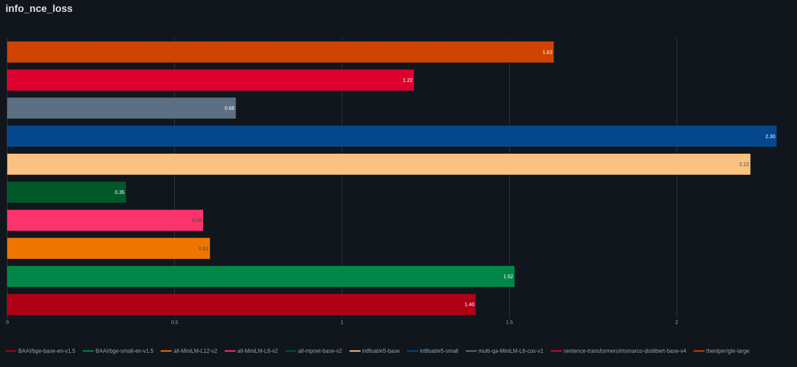
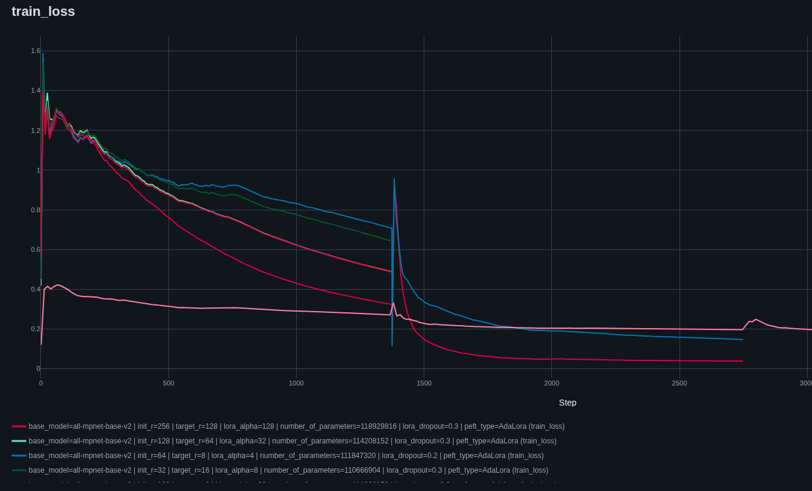
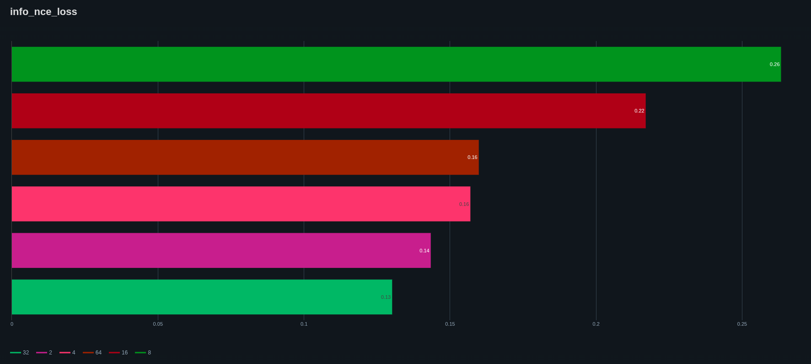
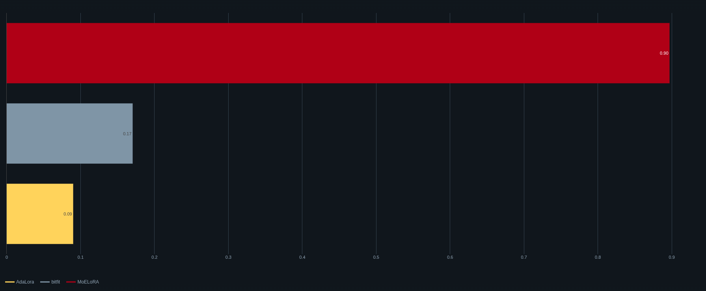
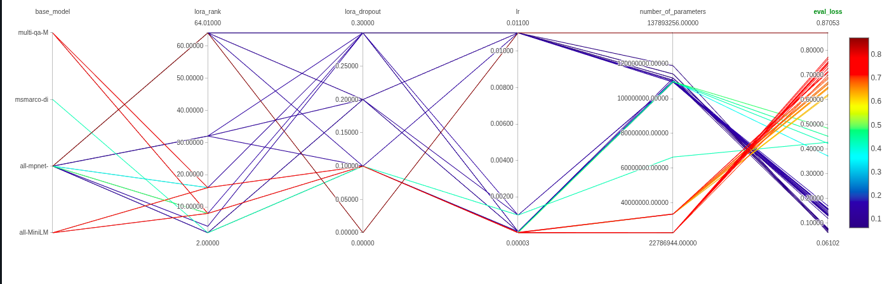
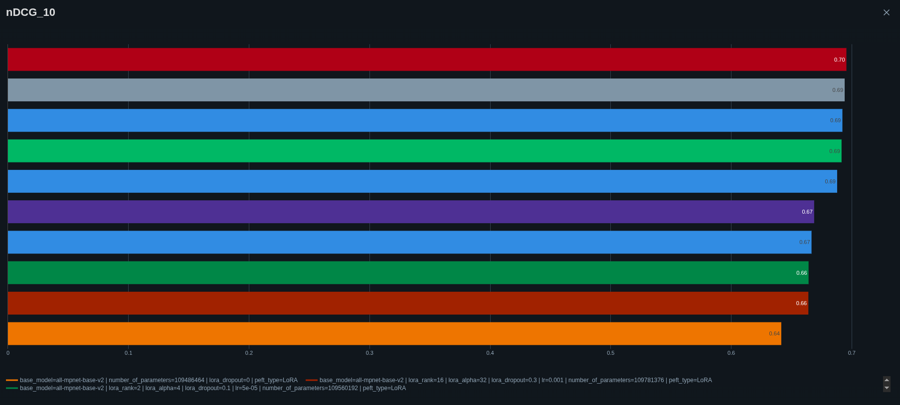

# RAG Financial Assistant 📈

A **Retrieval-Augmented Generation (RAG)** system specialized for financial question answering, featuring fine-tuned models using **PEFT techniques** (LoRA, AdaLoRA) with comprehensive **MLflow** experiment tracking.

This project combines the power of **LlamaIndex** for intelligent document retrieval with fine-tuned Hugging Face transformer models for accurate financial domain responses.

## 🌟 Key Features

- **Advanced PEFT Training**: Supports multiple Parameter Efficient Fine-Tuning methods (LoRA, AdaLoRA)
- **Comprehensive Model Evaluation**: Zero-shot evaluation of 10 embedding models with fine-tuning optimization
- **BEIR FiQA Dataset**: Trained and evaluated on the standard Financial Question Answering benchmark
- **MLflow Integration**: Complete experiment tracking and model versioning
- **Production Ready**: FastAPI backend with real-time inference and health monitoring
- **Lightweight Generation**: TinyLlama-1.1B for efficient response generation
- **Financial Domain Expertise**: Specialized retrieval system for financial document understanding

## 📊 Model Performance Analysis

### Zero-Shot Model Evaluation
We conducted comprehensive zero-shot evaluation on the **FiQA dataset** from BEIR benchmark, testing 10 different embedding models:

```python
evaluated_models = [
    "intfloat/e5-small",
    "intfloat/e5-base", 
    "BAAI/bge-small-en-v1.5",
    "BAAI/bge-base-en-v1.5",
    "all-MiniLM-L6-v2",
    "all-MiniLM-L12-v2",
    "multi-qa-MiniLM-L6-cos-v1",
    "all-mpnet-base-v2",           # 🏆 Best Performer
    "sentence-transformers/msmarco-distilbert-base-v4",
    "thenlper/gte-large"
]
```



**Winner**: `all-mpnet-base-v2` demonstrated superior performance over the info_nce_loss in a zero-shot setting
### PEFT Fine-Tuning Results
After identifying the best base model, we fine-tuned `all-mpnet-base-v2` using various PEFT techniques:



**Key Findings:**
- **Best Configuration**: LoRA with rank=64, alpha=128 (maintains base model performance: nDCG@10: 0.70)
- **Efficiency Sweet Spot**: Rank=32 provides faster convergence 50% fewer parameters
- **Training Stability**: All PEFT methods showed effective convergence around 1500 steps

### PEFT Configuration Analysis

#### LoRA Rank Optimization


Our hyperparameter sweep revealed optimal LoRA configurations:
- **Rank Values**: Tested from 2 to 64
- **Best Rank**: 64
- **Performance vs Efficiency**: Balanced approach for production deployment

#### Advanced PEFT Comparison


**Comparison Results:**
- **AdaLoRA**: Adaptive rank allocation for efficient fine-tuning
- **Standard LoRA**: Consistent performance across configurations
- **MoE-LoRA**: MoE-LoRA techniques that adds multiple lora modules by layer

### Hyperparameter Analysis


Our systematic hyperparameter optimization revealed:
- **Optimal LoRA Rank**: 64 (best performance vs parameter trade-off)
- **Alpha Values**: 128 showed consistent improvements
- **Dropout**: 0.1-0.3 range provided good regularization
- **Learning Rate**: 1e-4 to 5e-5 range optimal for stable training

## 🚀 Quick Start

### Prerequisites
```bash
pip install torch transformers
pip install llama-index
pip install mlflow
pip install fastapi uvicorn
pip install peft
```

### Installation
```bash
git clone https://github.com/yourusername/rag-financial-assistant.git
cd rag-financial-assistant
pip install -r requirements.txt
```

### Basic Usage
```python
# Direct API usage
import requests

response = requests.post(
    "http://localhost:8000/",
    json={"input_msg": "What was the revenue growth in Q3 2024?"}
)
print(response.json())
```

### Local Development Setup
```python
# Clone and setup
git clone https://github.com/yourusername/rag-financial-assistant.git
cd rag-financial-assistant

# Install dependencies with Poetry
poetry install
poetry shell

# Prepare your index (if not using pre-built)
python scripts/build_index.py

# Start the API server
python main.py
# Server will be available at http://localhost:8000
```

## 📈 Experiment Tracking

Our MLflow integration provides comprehensive experiment tracking:

- **Model Comparison**: Compare different base models and configurations
- **Hyperparameter Optimization**: Track the impact of various hyperparameters
- **Performance Metrics**: Monitor training loss, validation metrics, and inference speed
- **Model Versioning**: Manage different model versions and deployments

### Key Tracked Metrics
- `train_loss`: Training loss progression
- `info_nce_loss`: InfoNCE loss for contrastive learning
- `eval_loss`: Validation set performance
- `inference_time`: Model response latency
- `parameter_count`: Model efficiency metrics

## 🔍 Model Architecture

### Retrieval Component (Embedding Model)
- **Base Model**: `all-mpnet-base-v2` (selected from 10-model evaluation)
- **Fine-tuning**: AdaLoRA PEFT technique for domain adaptation
- **Vector Store**: LlamaIndex integration for efficient document retrieval
- **Dataset**: Trained on BEIR FiQA financial QA benchmark

### Generation Component
- **LLM**: TinyLlama-1.1B-Chat-v1.0 (lightweight and efficient)
- **Integration**: HuggingFace LLM wrapper via LlamaIndex
- **Context Management**: Intelligent retrieval-augmented context injection
- **Response Time**: Optimized for real-time inference

### System Pipeline
1. **Query Processing**: Input question preprocessing and embedding
2. **Document Retrieval**: Semantic search using fine-tuned embeddings  
3. **Context Preparation**: Retrieved documents formatted for generation
4. **Answer Generation**: TinyLlama generates contextual responses
5. **Response Delivery**: JSON response with answer and timing metrics

## 🌐 API Deployment

### FastAPI Server
```bash
# Start the API server
uvicorn main:app --host 0.0.0.0 --port 8000
```

### API Endpoints

#### Health Check
```bash
GET /health
```
Returns system health status.

#### Financial Question Answering
```bash
POST /
Content-Type: application/json

{
    "input_msg": "What are the key financial risks mentioned in the latest earnings report?"
}
```

**Response:**
```json
{
    "answer": "Based on the retrieved documents, the key financial risks include...",
    "elapsed_time": 0.85
}
```

### Example API Usage
```python
import requests

# Query the financial RAG system
response = requests.post(
    "http://localhost:8000/",
    json={"input_msg": "Analyze the debt-to-equity ratio trends"}
)

result = response.json()
print(f"Answer: {result['answer']}")
print(f"Response time: {result['elapsed_time']:.2f}s")
```

## 🐳 Docker Deployment

### Build Docker Image
```bash
docker build -t rag-financial-assistant .
```

### Run Container
```bash
docker run -p 8000:8000 rag-financial-assistant
```

## 📋 Configuration Options

### Production Configuration (main.py)
```python
# Model Configuration - Best Performing Setup
MODEL_NAME = "sentence-transformers/all-mpnet-base-v2"
ADAPTER_PATH = "models/all-mpnet-base-v2-lora-rank64/adapter"  # Best LoRA config
GENERATOR_NAME = "TinyLlama/TinyLlama-1.1B-Chat-v1.0"
INDEX_PATH = "data/index_store"
```

### Training Configuration
```yaml
base_model: "all-mpnet-base-v2"
dataset: "beir/fiqa"
peft_type: "lora"  # Best performing method

lora_config:
  rank: 64              # Optimal rank from experiments  
  alpha: 128            # Scaling factor
  dropout: 0.3
  target_modules: ["query", "value"]

training:
  learning_rate: 1e-4
  batch_size: 32
  num_epochs: 5
  eval_strategy: "steps"
  eval_steps: 100
```

## 🎯 Use Cases & Dataset

### FiQA Dataset (BEIR Benchmark)
The system is trained and optimized on the **Financial Question Answering (FiQA)** dataset, which includes:
- **Financial Questions**: Real-world questions about finance, investments, and economics
- **Expert Answers**: High-quality responses from financial experts
- **Domain Coverage**: Personal finance, corporate finance, investments, economics, and market analysis

### Supported Query Types
- **Investment Analysis**: "What factors affect stock price volatility?"
- **Personal Finance**: "How should I diversify my retirement portfolio?"
- **Corporate Finance**: "What are the implications of high debt-to-equity ratios?"
- **Market Trends**: "How do interest rate changes impact different sectors?"
- **Risk Assessment**: "What are the main risks in emerging market investments?"
- **Financial Planning**: "What's the difference between 401k and IRA accounts?"

## 📊 Performance Benchmarks

### Zero-Shot Model Evaluation on FiQA Dataset

| Model | nDCG@10 | Recall@10 | AP@10 | Parameters |
|-------|---------|-----------|-------|------------|
| intfloat/e5-small | 0.69 | 0.79 | 0.63 | 33M |
| intfloat/e5-base | 0.69 | 0.79 | 0.63 | 109M |
| BAAI/bge-small-en-v1.5 | 0.69 | 0.78 | 0.62 | 33M |
| BAAI/bge-base-en-v1.5 | 0.68 | 0.78 | 0.62 | 109M |
| all-MiniLM-L6-v2 | 0.67 | 0.76 | 0.60 | 22M |
| all-MiniLM-L12-v2 | 0.67 | 0.76 | 0.60 | 33M |
| multi-qa-MiniLM-L6-cos-v1 | 0.66 | 0.76 | 0.60 | 22M |
| msmarco-distilbert-base-v4 | 0.66 | 0.75 | 0.60 | 66M |
| **all-mpnet-base-v2** | **0.70** | **0.79** | **0.63** | **109M** |
| thenlper/gte-large | 0.57 | 0.62 | 0.53 | 335M |

**🏆 Winner**: `all-mpnet-base-v2` achieved the highest scores across all metrics, making it the optimal choice for fine-tuning.

### PEFT Fine-Tuning Results

After selecting `all-mpnet-base-v2` as the best base model, we fine-tuned it using different PEFT configurations:

#### Training Progress


#### PEFT Method Comparison



| PEFT Method | Rank | Alpha | nDCG@10 | Recall@10 | AP@10 | Parameters Added |
|-------------|------|-------|---------|-----------|-------|------------------|
| LoRA | 2 | 4 | 0.66 | 0.76 | 0.60 | ~1.1M |
| LoRA | 16 | 32 | 0.67 | 0.78 | 0.62 | ~8.7M |
| LoRA | 32 | 64 | 0.67 | 0.78 | 0.62 | ~17.4M |
| **LoRA** | **64** | **128** | **0.70** | **0.79** | **0.63** | **~34.8M** |

**Key Insights:**
- **Best Configuration**: LoRA with rank=64, alpha=128 matched the base model performance
- **Efficiency**: Lower rank configurations (2, 16) showed minor performance drops but significant parameter reduction
- **Trade-off**: Rank 32-64 provides optimal balance between performance and efficiency

### System Performance
| Component  | Memory Usage | Performance Metrics |
|-----------|---------------|--------------|-------------------|
| Embedding (Base)  | 1.1GB | nDCG@10: 0.70 |
| Embedding (LoRA r=64) | 1.14GB | nDCG@10: 0.70 |
| Retrieval | - | LlamaIndex vector search |
| Generation (TinyLlama)  | 2.2GB | 1.1B parameter model |
| **Total Pipeline** | **3.3GB** | **End-to-end financial QA** |

### BEIR FiQA Benchmark Results
| Configuration | nDCG@10 | Recall@10 | AP@10 | Improvement |
|---------------|---------|-----------|-------|-------------|
| Base all-mpnet-base-v2 | 0.70 | 0.79 | 0.63 | Baseline |
| + LoRA (rank=2) | 0.66 | 0.76 | 0.60 | -5.7% |
| + LoRA (rank=16) | 0.67 | 0.78 | 0.62 | -4.3% |
| + LoRA (rank=32) | 0.67 | 0.78 | 0.62 | -4.3% |
| **+ LoRA (rank=64)** | **0.70** | **0.79** | **0.63** | **±0%** |


